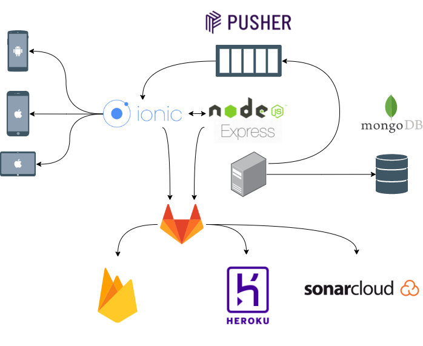

# HideNSneak

           

## Main idea

Our goal is create game for real world and give opportunity to fans of old game "Hide and Seek" to try themself in real world.

## Links

- https://hidensneak.web.app/
- https://hide-n-sneak-api.herokuapp.com/

Demo video:
- https://youtu.be/wJQgLktkWJA

## System architecture

In our app we used following technologies:
- Ionic (Angular + Cordova)
- Node.js (Express)
- Pusher
- MongoDB

At the end we were deployed our app on Firebase and Heroku.

## Installation and running

So you need first clone this repo.

We separated app on backend part and frontend part.

On the backend you can locally run API with the following commands:

1. `cd HideNSneak.Api`
2. (Optional) you need setup .env file
3. `npm install`
4. `npm start`

On the frontend you can locally run UI with the following commands:

1. `cd HideNSneak.UI`
2. (optional) you need setup `./src/environments/evironment.ts`
3. `npm install`
4. `npm run ionic:add:android`
5. (optional) `npm run ionic:prepare:android`
6. `npm run ionic:run:android`

If you want to run app in browser, you can run `npm start` or `npm run dev`.

